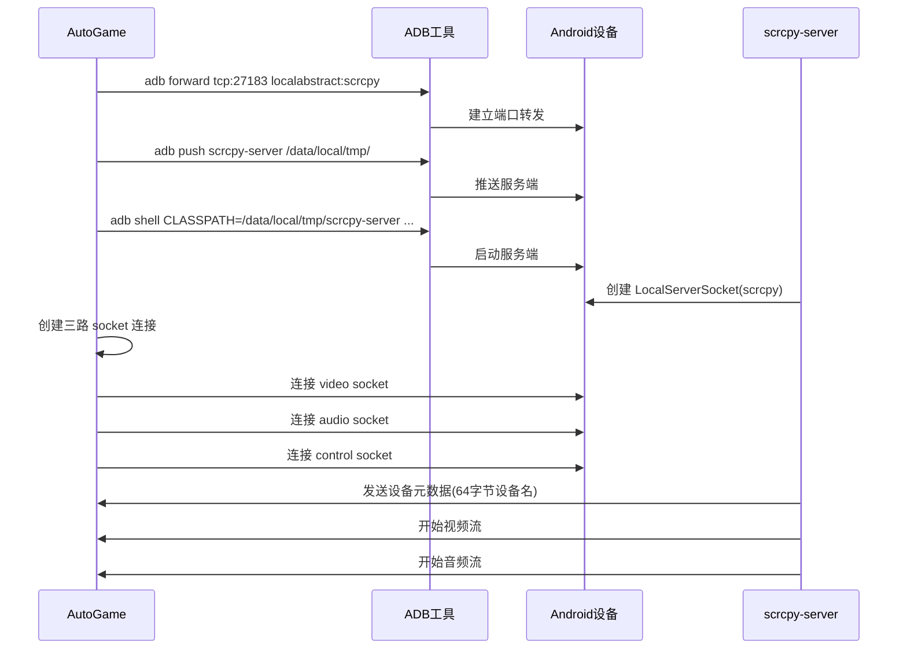
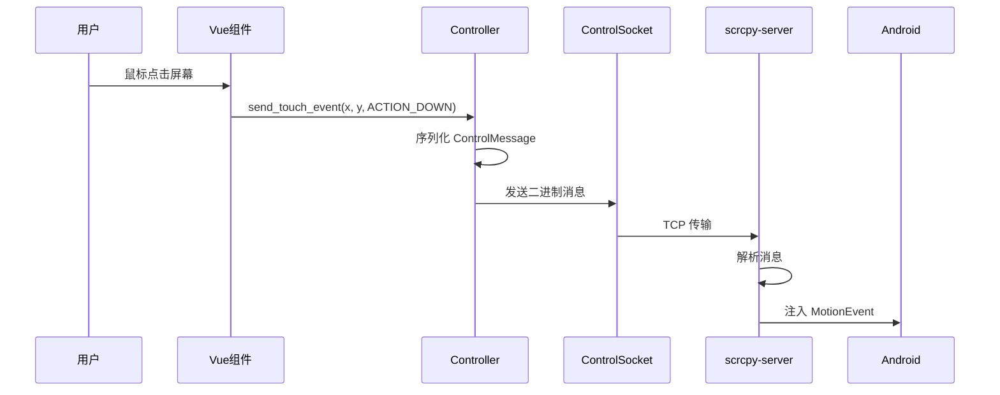

# AutoGame 手机投屏深度集成设计方案

## 1. 需求分析

### 1.1 业务背景

用户要求**深度集成** scrcpy-server 协议，而非简单调用 scrcpy.exe。AutoGame 需要直接处理：
- **视频流**：接收、解码、渲染
- **音频流**：接收、解码、播放
- **控制流**：键鼠映射、按键注入、系统控制

### 1.2 功能需求

| 需求编号 | 需求描述 | 优先级 | 来源 |
| :--- | :--- | :--- | :--- |
| REQ-001 | 直接与 scrcpy-server 通信 | 高 | 用户明确要求 |
| REQ-002 | 处理视频流（接收、解码、渲染） | 高 | 核心功能 |
| REQ-003 | 处理音频流（接收、解码、播放） | 高 | 核心功能 |
| REQ-004 | 处理控制流（键鼠映射、按键注入） | 高 | 核心功能 |
| REQ-005 | ADB 端口转发管理 | 高 | 通信基础 |
| REQ-006 | scrcpy-server 推送与启动 | 高 | 服务端部署 |
| REQ-007 | 自定义协议扩展 | 中 | 深度定制需求 |

---

## 2. scrcpy-server 协议架构分析

### 2.1 协议分层架构

```
┌─────────────────────────────────────────────────────────────┐
│                    AutoGame (客户端)                        │
│  ┌─────────────┐    ┌─────────────┐    ┌─────────────┐    │
│  │ 视频解码器   │    │ 音频解码器   │    │ 控制消息处理 │    │
│  │ + 渲染      │    │ + 播放      │    │ + 输入注入   │    │
│  └──────┬──────┘    └──────┬──────┘    └──────┬──────┘    │
│         │                  │                  │            │
│         ▼                  ▼                  ▼            │
│  ┌───────────────────────────────────────────────┐        │
│  │           协议解析层 (Protocol Parser)         │        │
│  │  - 视频帧头解析 (12字节 PTS + Size)           │        │
│  │  - 音频帧头解析                               │        │
│  │  - 控制消息序列化/反序列化                    │        │
│  └──────────────────────────┬───────────────────┘        │
│                             │                              │
│                             ▼                              │
│  ┌───────────────────────────────────────────────┐        │
│  │           ADB 端口转发 (Port Forwarding)      │        │
│  │  - 本地 Socket ↔ 设备 Socket                 │        │
│  └──────────────────────────┬───────────────────┘        │
└─────────────────────────────┼─────────────────────────────┘
                             │ ADB 协议
                             ▼
┌─────────────────────────────────────────────────────────────┐
│                 Android 设备 (scrcpy-server)               │
│  ┌─────────────┐    ┌─────────────┐    ┌─────────────┐    │
│  │ Video       │    │ Audio       │    │ Control     │    │
│  │ Encoder     │    │ Encoder     │    │ Channel     │    │
│  └──────┬──────┘    └──────┬──────┘    └──────┬──────┘    │
│         │                  │                  │            │
│         ▼                  ▼                  ▼            │
│  ┌───────────────────────────────────────────────┐        │
│  │          DesktopConnection (三路 Socket)      │        │
│  │  - video: localhost:27183                    │        │
│  │  - audio: localhost:27183                    │        │
│  │  - control: localhost:27183                 │        │
│  └───────────────────────────────────────────────┘        │
└─────────────────────────────────────────────────────────────┘
```

### 2.2 核心数据流

根据源码分析 (`Streamer.java`、`DesktopConnection.java`)：

#### 2.2.1 视频流格式

| 数据段 | 大小 | 说明 |
| :--- | :--- | :--- |
| 帧头（可选） | 12 字节 | PTS (8字节) + 包大小 (4字节) |
| 帧数据 | 可变 | H.264/H.265 编码数据 |

**帧头结构**（`Streamer.java` 第 107-124 行）：
```
┌─────────────────────────────────────────────────────────────┐
│  0-7 字节: PTS (Presentation Time Stamp) + 标志位         │
│            bit 63: PACKET_FLAG_SESSION (会话元数据)        │
│            bit 62: PACKET_FLAG_CONFIG (配置帧)            │
│            bit 61: PACKET_FLAG_KEY_FRAME (关键帧)         │
│  8-11 字节: 包大小 (小端序)                               │
└─────────────────────────────────────────────────────────────┘
```

#### 2.2.2 音频流格式

| 数据段 | 大小 | 说明 |
| :--- | :--- | :--- |
| 编解码器 ID | 4 字节 | 0=H264, 1=H265, 2=AV1, 音频编解码器 ID |
| 帧数据 | 可变 | Opus/FLAC 编码数据 |

#### 2.2.3 控制消息格式

根据 `ControlMessage.java`，支持的消息类型：

| 类型码 | 消息类型 | 用途 |
| :--- | :--- | :--- |
| 0 | TYPE_INJECT_KEYCODE | 注入按键事件 |
| 1 | TYPE_INJECT_TEXT | 注入文本输入 |
| 2 | TYPE_INJECT_TOUCH_EVENT | 注入触摸事件 |
| 3 | TYPE_INJECT_SCROLL_EVENT | 注入滚动事件 |
| 4 | TYPE_BACK_OR_SCREEN_ON | 返回/亮屏 |
| 8 | TYPE_GET_CLIPBOARD | 获取剪贴板 |
| 9 | TYPE_SET_CLIPBOARD | 设置剪贴板 |
| 10 | TYPE_SET_DISPLAY_POWER | 设置显示电源状态 |
| 16 | TYPE_START_APP | 启动应用 |

---

## 3. 技术方案

### 3.1 技术选型

| 分类 | 技术 | 版本 | 选型理由 |
| :--- | :--- | :--- | :--- |
| 语言 | Python | 3.10+ | 项目已有基础，网络编程成熟 |
| 视频解码 | FFmpeg | 6.x | 支持 H.264/H.265，跨平台 |
| 音频解码 | PyAudio / soundfile | - | 音频播放支持 |
| 网络通信 | socket | 内置 | ADB 端口转发通信 |
| 编解码绑定 | ffmpeg-python / av | - | FFmpeg Python 绑定 |
| 前端渲染 | Vue 3 + Canvas | 3.x | 视频帧渲染 |

### 3.2 模块划分

| 模块 | 职责 | 状态 |
| :--- | :--- | :--- |
| `src/scrcpy/protocol.py` | 协议解析（帧头、控制消息） | 新增 |
| `src/scrcpy/streamer.py` | 视频/音频流接收与解码 | 新增 |
| `src/scrcpy/controller.py` | 控制消息发送（键鼠注入） | 新增 |
| `src/scrcpy/adb.py` | ADB 通信、端口转发、服务端推送 | 新增 |
| `src/scrcpy/server.py` | scrcpy-server 启动与管理 | 新增 |
| `frontend/src/components/Screencast.vue` | 投屏页面、视频渲染、用户输入 | 新增 |

### 3.3 核心流程图

**连接建立流程：**



**控制消息发送流程：**



---

## 4. 协议实现细节

### 4.1 控制消息序列化

根据 `ControlMessage.java` 的序列化逻辑，消息格式如下：

```python
# 消息头 (固定 12 字节)
struct ControlMessageHeader:
    type: uint32        # 消息类型
    reserved: uint32    # 保留字段
    body_size: uint32   # 消息体大小

# 消息体根据类型不同而变化
# TYPE_INJECT_TOUCH_EVENT (type=2):
struct InjectTouchEventBody:
    action: uint32      # MotionEvent.ACTION_*
    pointer_id: uint64  # 指针ID
    x: int32            # X坐标 (Q16格式)
    y: int32            # Y坐标 (Q16格式)
    pressure: uint32    # 压力 (Q16格式)
    action_button: uint32
    buttons: uint32

# TYPE_INJECT_KEYCODE (type=0):
struct InjectKeycodeBody:
    action: uint32      # KeyEvent.ACTION_*
    keycode: uint32     # KeyEvent.KEYCODE_*
    repeat: uint32
    meta_state: uint32
```

**Q16 格式说明**：坐标值乘以 65536 (2^16) 后存储为整数

### 4.2 视频帧解析

```python
def parse_video_frame(data: bytes) -> dict:
    """解析视频帧数据"""
    offset = 0
    
    # 帧头 (12字节)
    pts_and_flags = int.from_bytes(data[offset:offset+8], 'little')
    offset += 8
    
    is_config = bool(pts_and_flags & (1 << 62))
    is_key_frame = bool(pts_and_flags & (1 << 61))
    pts = pts_and_flags & ~((1 << 61) | (1 << 62) | (1 << 63))
    
    packet_size = int.from_bytes(data[offset:offset+4], 'little')
    offset += 4
    
    # 帧数据
    frame_data = data[offset:offset+packet_size]
    
    return {
        'pts': pts,
        'is_config': is_config,
        'is_key_frame': is_key_frame,
        'data': frame_data
    }
```

---

## 5. API 接口设计

### 5.1 接口列表

| API 路径 | 方法 | 功能描述 |
| :--- | :--- | :--- |
| `/api/screencast/connect` | POST | 连接设备并启动投屏 |
| `/api/screencast/disconnect` | POST | 断开连接 |
| `/api/screencast/status` | GET | 获取连接状态 |
| `/api/screencast/control` | POST | 发送控制消息 |
| `/api/screencast/stream` | WebSocket | 视频/音频流传输 |

### 5.2 连接接口

**POST /api/screencast/connect**

请求体：
```json
{
    "device_serial": "1234567890abcdef",
    "max_size": 1080,
    "max_fps": 60,
    "bit_rate": "8M",
    "video": true,
    "audio": true,
    "control": true
}
```

响应：
```json
{
    "code": 0,
    "message": "连接成功",
    "data": {
        "device_name": "Pixel 8 Pro",
        "resolution": "1080x2400",
        "stream_url": "ws://localhost:8080/api/screencast/stream"
    }
}
```

### 5.3 控制接口

**POST /api/screencast/control**

请求体：
```json
{
    "type": "touch",
    "action": "down",
    "x": 100,
    "y": 200,
    "pressure": 1.0
}
```

---

## 6. 代码安全性

### 6.1 风险点

| 风险点 | 等级 | 说明 |
| :--- | :--- | :--- |
| 缓冲区溢出 | 高 | 协议解析时边界检查不足 |
| 拒绝服务 | 高 | 恶意设备发送超大数据包 |
| 命令注入 | 中 | ADB 命令构造时的注入风险 |
| 信息泄露 | 低 | 日志中可能包含敏感信息 |
| 未授权访问 | 中 | 端口转发可能被滥用 |

### 6.2 解决方案

| 风险点 | 解决方案 |
| :--- | :--- |
| 缓冲区溢出 | 严格校验数据包长度；使用固定大小缓冲区 |
| 拒绝服务 | 设置最大包大小限制；实现流量控制 |
| 命令注入 | 使用 `subprocess.Popen` 列表参数形式；过滤设备序列号 |
| 信息泄露 | 日志脱敏；限制日志级别 |
| 未授权访问 | 本地回环绑定；连接前验证设备 |

---

## 7. 部署与集成

### 7.1 依赖安装

```bash
# 安装 FFmpeg
sudo apt install ffmpeg  # Linux
brew install ffmpeg      # macOS
# Windows: 下载预编译版本

# Python 依赖
pip install ffmpeg-python pyaudio websockets
```

### 7.2 文件结构

```
AutoGame/
├── src/
│   └── scrcpy/
│       ├── __init__.py
│       ├── adb.py          # ADB 通信
│       ├── protocol.py     # 协议解析
│       ├── streamer.py     # 流处理
│       ├── controller.py   # 控制消息
│       └── server.py       # 服务管理
├── frontend/
│   └── src/
│       └── components/
│           └── Screencast.vue
├── scrcpy-win64-v4.0/
│   └── scrcpy-server      # 服务端二进制
└── ...
```

---

## 附录：scrcpy-server 启动参数

```bash
# 标准启动命令
adb shell CLASSPATH=/data/local/tmp/scrcpy-server \
    app_process / com.genymobile.scrcpy.Server \
    --tcpip=27183 \
    --max-size=1080 \
    --max-fps=60 \
    --bit-rate=8000000 \
    --video \
    --audio \
    --control
```

**参数说明：**

| 参数 | 说明 |
| :--- | :--- |
| `--tcpip=<port>` | TCP 端口 |
| `--max-size=<n>` | 最大分辨率 |
| `--max-fps=<n>` | 最大帧率 |
| `--bit-rate=<n>` | 比特率（单位：bps） |
| `--video` | 启用视频流 |
| `--audio` | 启用音频流 |
| `--control` | 启用控制通道 |

---

**文档版本**: v2.0（深度集成版）  
**创建日期**: 2026-05-15  
**适用项目**: AutoGame  
**作者**: System
